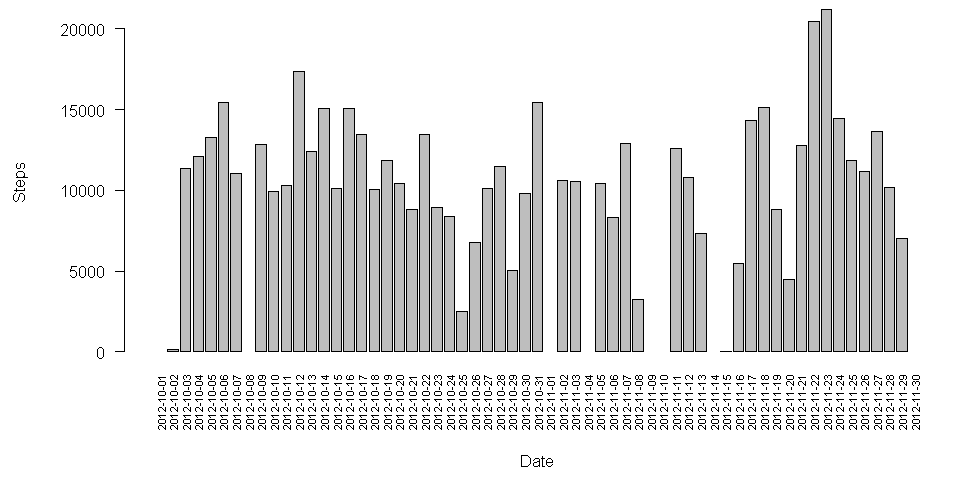
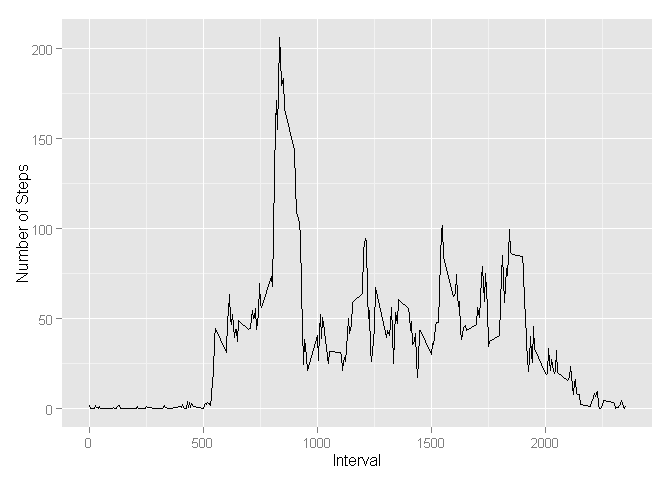
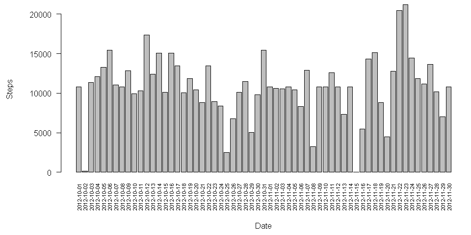
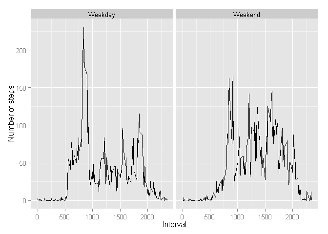

# Reproducible Research: Peer Assessment 1
Load required libraries

```r
require(knitr)
require(ggplot2)
require(plyr)
```

Bulk edit knitr options

```r
#opts_chunk$set(message = FALSE, warning = FALSE, error = FALSE)
```

## Loading and preprocessing the data
1. Load the data (i.e. read.csv())

```r
unzip("activity.zip")
activity <- read.csv("activity.csv", header = TRUE)
```

2. Process/transform the data (if necessary) into a format suitable for your analysis

```r
activity$date <- as.Date(activity$date)
```

## What is mean total number of steps taken per day?
1. Histogram of the total number of steps taken each day

```r
# Get total number of steps taken each day
stepsPerDay <- ddply(activity, ~date, summarise, steps = sum(steps))
# Plot Graph
par(mar = c(6.5, 6.5, 0.5, 0.5), mgp = c(5, 1, 0))
barplot(stepsPerDay$steps, names.arg = stepsPerDay$date, xlab = "Date", ylab = "Steps",las=2, cex.names=0.7)
```

 
2. Calculate and report the **mean** and **median** total number of steps taken per day

```r
mean(stepsPerDay$steps, na.rm = TRUE)
```

```
## [1] 10766.19
```

```r
median(stepsPerDay$steps, na.rm = TRUE)
```

```
## [1] 10765
```

## What is the average daily activity pattern?
1. Make a time series plot (i.e. type = "l") of the 5-minute interval (x-axis) and the average number of steps taken, averaged across all days (y-axis)

```r
# Get average steps per 5-minute interval
avgStepsPerInterval <- ddply(activity, ~interval, summarise, mean = mean(steps, na.rm = TRUE))
# Plot Graph
p <- ggplot(avgStepsPerInterval, aes(interval, mean)) + geom_line()
p + xlab("Interval") + ylab("Number of Steps")
```

 

2. Which 5-minute interval, on average across all the days in the dataset, contains the maximum number of steps?

```r
avgStepsPerInterval$interval[which.max(avgStepsPerInterval$mean)]
```

```
## [1] 835
```

## Imputing missing values
Note that there are a number of days/intervals where there are missing values (coded as NA). The presence of missing days may introduce bias into some calculations or summaries of the data.
1. Calculate and report the total number of missing values in the dataset (i.e. the total number of rows with NAs)

```r
sum(is.na(activity))
```

```
## [1] 2304
```

2. Devise a strategy for filling in all of the missing values in the dataset. The strategy does not need to be sophisticated. For example, you could use the mean/median for that day, or the mean for that 5-minute interval, etc.
3. Create a new dataset that is equal to the original dataset but with the missing data filled in.

```r
activityFull <- ddply(activity, ~interval, function(dd) {
    steps <- dd$steps
    dd$steps[is.na(steps)] <- mean(steps, na.rm = TRUE)
    return(dd)
})
```

4. Make a histogram of the total number of steps taken each day and Calculate and report the mean and median total number of steps taken per day. Do these values differ from the estimates from the first part of the assignment? What is the impact of imputing missing data on the estimates of the total daily number of steps?

```r
# Get total number of steps taken each day
stepsPerDayFull <- ddply(activityFull, ~date, summarise, steps = sum(steps))
# Plot Graph
par(mar = c(6.5, 6.5, 0.5, 0.5), mgp = c(5, 1, 0))
barplot(stepsPerDayFull$steps, names.arg = stepsPerDayFull$date, xlab = "Date", ylab = "Steps",las=2, cex.names=0.7)
```

 

```r
# Calculate Mean
mean(stepsPerDayFull$steps, na.rm = TRUE)
```

```
## [1] 10766.19
```

```r
# Calculate Median
median(stepsPerDayFull$steps, na.rm = TRUE)
```

```
## [1] 10766.19
```

## Are there differences in activity patterns between weekdays and weekends?
For this part the weekdays() function may be of some help here. Use the dataset with the filled-in missing values for this part.

1. Create a new factor variable in the dataset with two levels - "weekday" and "weekend" indicating whether a given date is a weekday or weekend day.

```r
weekLevels <- c("Weekday", "Weekend")

activityFull$weeklevel <- sapply(activityFull$date, function(date) {
    day <- weekdays(date)
    part <- factor("Weekday", weekLevels)
    if (day %in% c("Saturday", "Sunday")) 
        part <- factor("Weekend", weekLevels)
    return(part)
})
```

2. Make a panel plot containing a time series plot (i.e. type = "l") of the 5-minute interval (x-axis) and the average number of steps taken, averaged across all weekday days or weekend days (y-axis). See the README file in the GitHub repository to see an example of what this plot should look like using simulated data.

```r
avgSteps <- ddply(activityFull, .(interval, weeklevel), summarise, mean = mean(steps))

p <- ggplot(avgSteps, aes(x = interval, y = mean))
p <- p + geom_line() + facet_grid(. ~ weeklevel, )
p + xlab("Interval") + ylab("Number of steps")
```

 
